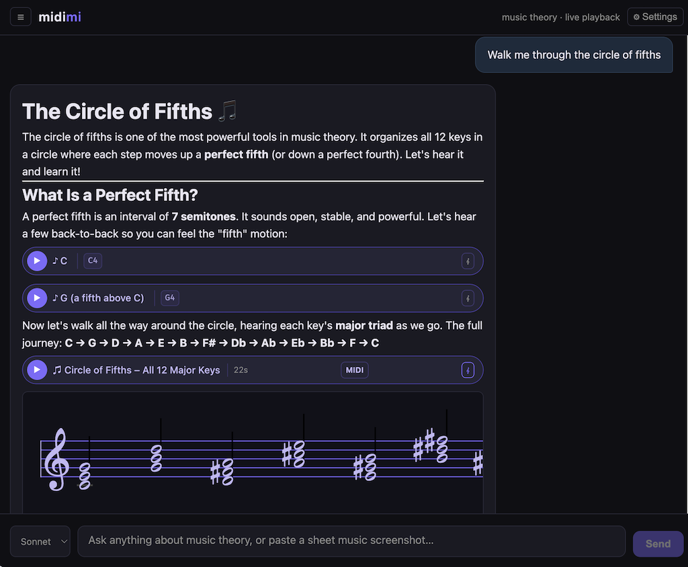

# midimi

> **Local use only.** midimi is designed to run on your own machine and has no authentication, rate limiting, or access controls. Do not expose it on a public network or shared host.

> **Vibe coded.** This was a quick one-off to unblock my music theory learning journey. Midimi is not meant to be a stellar example of my engineering prowess (as can be seen by the nearly 2kloc server.py implementation).


## Why midimi?

This is a personal project to help me learn music theory. I've been using LLMs (chat interfaces like ChatGPT) to learn music theory and find the lack of inline note/chord playback very limiting. So I conjured up midimi, a LLM driven music theory chatbot that will explain music theory concepts *and* play the examples live through my speakers with reasonable quality and accuracy (though the model you chose impacts accuracy). Midime can also direct output to Garageband or Ableton for example, but I haven't played with that much as the core use case is just simple playback to match theory to sound.

Ask: *"explain the difference between major and minor chords"*

Midimi (using a supplied Claude API key) explains the theory, then makes the chords available for immediate playback through your speakers — a **C major** pill and a **C minor** pill appear in the chat, each clickable to play. You can unfold the pill to see how the notes/chords/sequences appear on a staff. Historical conversations are presented on the left like all chat style interfaces, and they can be individually 'starred'.



 

## Requirements

- macOS (uses CoreAudio)
- Python 3.11+
- [Homebrew](https://brew.sh)
- An [Anthropic API key](https://console.anthropic.com/)

## Setup

### 1. Install FluidSynth

```bash
brew install fluid-synth
```

### 2. Get a soundfont

FluidSynth needs a General MIDI soundfont (`.sf2`) to produce sound. GeneralUser GS is free and works well (I found the latest here: https://www.schristiancollins.com/generaluser). Place it at `~/Music/GeneralUser-GS.sf2`. If you save it elsewhere, set `SOUNDFONT` when you run the server (see [Configuration](#configuration) below).

Verify FluidSynth can use it:

```bash
fluidsynth -a coreaudio ~/Music/GeneralUser-GS.sf2
# at the > prompt, type: noteon 0 60 100
# you should hear a piano note. type: quit
```

### 3. Install Python dependencies

```bash
python3 -m venv .venv
.venv/bin/pip install anthropic fastapi mido pyfluidsynth uvicorn
```

### 4. Run

```bash
.venv/bin/uvicorn server:app
```

Then open **http://localhost:8000** in your browser. Enter your Anthropic API key in the Settings modal (⚙) the first time you run it.

## Configuration

| Environment variable | Default | Description |
|---|---|---|
| `SOUNDFONT` | `~/Music/GeneralUser-GS.sf2` | Path to your `.sf2` soundfont file. Defaults to that location if unset. |

If your soundfont is in a different location:

```bash
SOUNDFONT=/path/to/your.sf2 .venv/bin/uvicorn server:app
```

## Loop transport

A looping backing track: it plays a chord chart in time — piano comp, root bass, and a
click — until you stop it, and exposes where you are in the form.

```bash
curl -X POST localhost:8000/loop/start -H 'content-type: application/json' -d '{
  "chords": [
    {"symbol": "F7",  "bars": 4}, {"symbol": "Bb7", "bars": 2},
    {"symbol": "F7",  "bars": 2}, {"symbol": "C7",  "bars": 1},
    {"symbol": "Bb7", "bars": 1}, {"symbol": "F7",  "bars": 2}
  ],
  "tempo_bpm": 120, "feel": "shuffle"
}'
```

| Endpoint | What it does |
|---|---|
| `POST /loop/start` | Start (or replace) the loop; returns the initial position and rendered chart |
| `POST /loop/stop` | Stop the loop and release any sounding notes |
| `GET /loop/position` | Current `bar`, `beat`, `chord`, `next_chord` — poll this to draw a bar cursor |
| `GET /loop/chart` | The rendered chart with per-chord voicings |

Options on `/loop/start`: `tempo_bpm`, `time_signature`, `feel` (`straight`/`shuffle`),
`count_in_bars`, `comp_style` (`charleston`/`pad`), `voicing_style`, `repeats`, and
`click` / `comp` / `bass` toggles. Set `rootless: true` to drop the root from the comp
voicings so you can practise rootless shapes against the bass.

Bar and beat are reported on the straight grid even under shuffle — the feel changes where
notes land, not where you count. The comp, bass, and click use MIDI channels 1, 2, and 9,
so ordinary chord playback (channel 0) still works over a running loop.

## Chord charts

Charts are the *form* layer over the loop: bars, chords, repeats, and a key. They are stored
as **roman numerals plus a key**, not as chord symbols, which is what makes them transposable
to any key with correct spelling (the IV of G♭ is C♭, not B) and what makes the roman-numeral
overlay free — every rendered bar carries both its symbol and its numeral.

```bash
curl 'localhost:8000/charts/blues-12-bar?key=Bb&mode=triad'
curl -X POST localhost:8000/charts/loop -H 'content-type: application/json' \
  -d '{"chart_id": "blues-12-bar-slow", "key": "F", "mode": "dominant7", "tempo_bpm": 62}'
```

| Endpoint | What it does |
|---|---|
| `GET /charts` | The built-in charts and the available modes |
| `GET /charts/{id}?key=&mode=` | Render a chart into concrete bars, symbols *and* numerals |
| `POST /charts/loop` | Render a chart and start the loop on it, in one call |

Built-ins: `blues-12-bar`, `blues-12-bar-quick-change`, `blues-12-bar-slow`, `ii-v-i`.

**Modes re-quality the same form**, so the week-2 triad blues and the week-3 all-dominant
blues are provably the same twelve bars rather than two charts that can drift:

| Mode | Bar 1 of a blues in F |
|---|---|
| `triad` | `F` |
| `dominant7` | `F7` |
| `seventh` | `Fmaj7` (but V stays dominant) |
| `as_written` | whatever the chart says |

`POST /charts/loop` also accepts an inline `chart` instead of a `chart_id`, so a chart can be
authored on the fly. Slots may be roman numerals (`"I"`, `"ii7"`, `"bVII"`) or literal chord
symbols (`"F7"`); numerals are preferred because they transpose exactly. Use sections for
repeats:

```json
{"chart": {"name": "Rhythm A", "key": "C",
           "sections": [{"slots": ["I", "vi", "ii", "V"], "repeat": 2}]},
 "key": "Eb", "mode": "seventh"}
```

The chat agent has `list_charts`, `show_chart`, `start_chart_loop` and `stop_loop`, so
*"give me a slow blues in F"* starts a running loop rather than a one-shot playback.

## Usage tips

- Ask about any music theory concept — chord types, scales, intervals, progressions, modes
- Click ▶ on any pill to play a chord or sequence; click the note chips to hear individual notes
- Click 𝄞 to see the chord or sequence rendered on a staff
- Try prompts like:
  - *"Walk me through the circle of fifths"*
  - *"What makes a dominant 7th chord tense?"*
  - *"Show me a ii-V-I progression in C major"*
  - *"What's the difference between Dorian and Aeolian mode?"*
